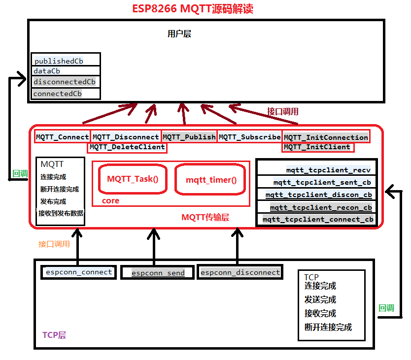

根据自己的经验和阅读ESP8266_NONOS_SDK_2.2.1的mqtt.c源码分析MQTT通讯流程

首先需要一个MQTT_Task运行任务
```
void MQTT_Task()
{
    switch(mqttClient.state)
    {
        case MQTT_TCP_RECONNECT_REQ:    //TCP 等待重连

        break;

        case MQTT_TCP_RECONNECT:        //TCP 开始重连
        
        break;

        case MQTT_TCP_CONNECTING:       //TCP连接中 等待连接响应

        break;

        case MQTT_START_CON:            //MQTT开始连接

        break;

        case MQTT_WAIT_CON_RESP:        //MQTT等待连接响应

        break;

        case MQTT_WAIT_PING_RESP:       //MQTT等待心跳响应

        break;

        case MQTT_COMMUNICATING:        //MQTT数据通讯状态

        break;
    }
}
```
以前看mbed TLS源码的时候，在整个握手阶段，也会有这样类似的任务或函数，根据当前操作对象的状态来进行下一步的代码执行，最后一个状态一般就是正常通讯状态。

ESP8266自己已经实现了MQTT通讯层的所有功能，用户只要调用其对外的接口函数即可，如下：
```
//1.配置服务器的IP、Port、是否加密   2.初始化MQTT客户端 连接信息
void MQTT_InitConnection(MQTT_Client *mqttClient, uint8_t* host, uint32_t port, uint8_t security);
void MQTT_InitClient(MQTT_Client *mqttClient, uint8_t* client_id, uint8_t* client_user, uint8_t* client_pass, 
                     uint32_t keepAliveTime, uint8_t cleanSession);

//订阅 取消订阅 连接 断开 发布
BOOL MQTT_Subscribe(MQTT_Client *client, char* topic, uint8_t qos);
BOOL MQTT_UnSubscribe(MQTT_Client *client, char* topic);
void MQTT_Connect(MQTT_Client *mqttClient);
void MQTT_Disconnect(MQTT_Client *mqttClient);
BOOL MQTT_Publish(MQTT_Client *client, const char* topic, const char* data, int data_length, int qos, int retain);

//注册连接 断开 发布 超时 接收到数据 的用户层回调函数
void MQTT_OnConnected(MQTT_Client *mqttClient,    MqttCallback connectedCb);
void MQTT_OnDisconnected(MQTT_Client *mqttClient, MqttCallback disconnectedCb);
void MQTT_OnPublished(MQTT_Client *mqttClient,    MqttCallback publishedCb);
void MQTT_OnTimeout(MQTT_Client *mqttClient,      MqttCallback timeoutCb);
void MQTT_OnData(MQTT_Client *mqttClient,         MqttDataCallback dataCb);

typedef void (*MqttCallback)(uint32_t *args);
typedef void (*MqttDataCallback)(uint32_t *args, const char* topic, uint32_t topic_len, const char *data, uint32_t lengh);

一般我们用MQTT_OnData注册接收到数据的回调函数，在该回调函数内 处理接收到的数据。

所以使用ESP8266的MQTT其实比较简单，但是SIM800C的EAT(就是SDK)源码内没有MQTT通讯层的实现，所以我就学习ESP8266的MQTT源码，然后应
用到SIM800C上。 接下来先分析8266的MQTT源码吧。
```

## 1. 8266的MQTT源码在examples/esp_mqtt_proj/mqtt下 ##
主要文件：
```
|- mqtt.c       MQTT通讯层主要代码
|- mqtt_msg.c   MQTT组包接口函数
|- proto.c      将一段数据放入缓存的协议 (0x7E作为数据包头 0x7F作为包尾 0x7D作为转义0x7D 0x7E 0x7F)
|- queue.c      整合proto.c和ringbuf.c 向外提供QUEUE_Puts() QUEUE_Gets() QUEUE_Init()接口函数 
|- ringbuf.c    环形缓存的实现
|- utils.c      字符转数字等工具函数

1. 其中 proto.c queue.c ringbuf.c是一个组合，外部调用缓冲区存取数据，只要包含queue.h即可。
2. mqtt_msg.c 就是组包以及获取接收到的发布包的主题和消息等函数
3. mqtt.c 就是我们关注的重点了，内部自己利用伪操作系统跑了MQTT_Task，来处理内部MQTT传输层的业务，对外封装了上面已经说过的几个接口函数。
```

## 2. 先看MQTT_Client结构体，该结构体活动于整个MQTT应用层： ##
```
typedef struct  {
	struct espconn       *pCon;           //8266TCP连接必须的结构体 连接信息填入该结构体
	uint8_t              security;        //MQTT_InitConnection()接口函数中赋值  是否加密
	uint8_t              *host;           //MQTT_InitConnection()接口函数中赋值  host
	uint32_t             port;            //MQTT_InitConnection()接口函数中赋值  端口
	ip_addr_t            ip;              //在MQTT_Connect()中调用DNS，获取host对应的IP
	mqtt_state_t         mqtt_state;      //MQTT要发送的数据包和接收到的数据包 缓存由该结构体管理 见下3
	mqtt_connect_info_t  connect_info;    //结构体见下1， 记录MQTT连接使用的信息 在MQTT_InitClient()接口函数赋值
	MqttCallback         connectedCb;     //调用该函数 注册MQTT连接完成回调用户层应用函数
	MqttCallback         disconnectedCb;  //注册MQTT连接断开回调
	MqttCallback         publishedCb;     //注册MQTT发布完成回调
	MqttCallback         timeoutCb;       //注册MQTT超时回调
	MqttDataCallback     dataCb;          //注册MQTT数据接收完成回调 用户层处理数据的地方
	ETSTimer             mqttTimer;       //mqtt应用层的定时器，该定时器调用mqtt_timer回调函数 累加keepAliveTick、
                                            reconnectTick、累减sendTimeout。
	uint32_t             keepAliveTick;   //心跳计数 达到初始化Client时赋值的keepalive 时，开始心跳.
	uint32_t             reconnectTick;   //TCP等待重新连接计数，在client.connState = TCP_RECONNECT_REQ时 在mqtt_timer
                                            定时器(1秒1次)累加达到MQTT_RECONNECT_TIMEOUT时，开始重连。 
	uint32_t             sendTimeout;     //每发1次数据 被赋值为发送超时时间(5s) 在tcp发送完成回调函数中清零 或mqtt_timer
                                            中倒计时到0 在该变量>0时，不允许发送第二包数据。
	tConnState           connState;       //client 连接状态 见下2
	QUEUE                msgQueue;        //存放待发送数据的 环形缓存
	void*                user_data;
} MQTT_Client;

MQTT_Client内部使用的结构体：
1.
typedef struct mqtt_connect_info
{
  char* client_id;
  char* username;
  char* password;
  char* will_topic;
  char* will_message;
  int keepalive;
  int will_qos;
  int will_retain;
  int clean_session;
};

2.
typedef enum {
	WIFI_INIT,
	WIFI_CONNECTING,
	WIFI_CONNECTING_ERROR,
	WIFI_CONNECTED,
	DNS_RESOLVE,
	TCP_DISCONNECTING,
	TCP_DISCONNECTED,
	TCP_RECONNECT_DISCONNECTING,
	TCP_RECONNECT_REQ,
	TCP_RECONNECT,
	TCP_CONNECTING,
	TCP_CONNECTING_ERROR,
	TCP_CONNECTED,
	MQTT_CONNECT_SEND,
	MQTT_CONNECT_SENDING,
	MQTT_SUBSCIBE_SEND,
	MQTT_SUBSCIBE_SENDING,
	MQTT_DATA,
	MQTT_KEEPALIVE_SEND,
	MQTT_PUBLISH_RECV,
	MQTT_PUBLISHING,
	MQTT_DELETING,
	MQTT_DELETED,
} tConnState;

3.
typedef struct mqtt_state_t
{
  uint16_t              port;
  int                   auto_reconnect;
  mqtt_connect_info_t*  connect_info;            //在MQTT_InitClient()指向mqtt_client的connect_info
  uint8_t*              in_buffer;               //接收缓存 在MQTT_InitClient()分配堆内存1024Byte
  uint8_t*              out_buffer;              //发送缓存 在MQTT_InitClient()分配堆内存1024Byte 存放组好包的数据
  int                   in_buffer_length;        //接收缓存大小 在MQTT_InitClient()赋值为1024
  int                   out_buffer_length;       //发送缓存大小 在MQTT_InitClient()赋值为1024
  uint16_t              message_length;          //TCP接收到的MQTT数据包的 数据(是根据协议格式算的，第二个字节是剩余长度)
  uint16_t              message_length_read;     //一次TCP接收到的总数据 一般等于message_length
  mqtt_message_t*       outbound_message;        //指向组好包的数据信息 
  mqtt_connection_t     mqtt_connection;         //在MQTT_InitClient()初始化，将buffer指向out_buffer，
                                                   buffer_length=out_buffer_length 组包函数 第一个参数都是传它
  uint16_t              pending_msg_id;          //记录最新发送的数据包的ID
  int                   pending_msg_type;        //记录最新发送的数据包的类型 用于在接收到连接、订阅、心跳等响应包时比较 响
                                                   应包是否合法
  int                   pending_publish_qos;     //
} mqtt_state_t;

4.
typedef struct mqtt_message
{ 
  uint8_t*  data;
  uint16_t  length;
} mqtt_message_t;

5.
typedef struct mqtt_connection
{
  mqtt_message_t  message;
  uint16_t        message_id;
  uint8_t*        buffer;
  uint16_t        buffer_length;    
                                 //刚开始这里比较奇怪 已经有buffer可以指向组建的数据包了，为什么还有mqtt_message_t这个结构体
                                 //后来看组包的函数 发现8266的mqtt组包，先在前面占3个字节，第1个是包头，后2个是剩余长度，但是
                                 //标准的mqtt协议中剩余长度是可以1到4的，在8266的组包函数最后都会调用fini_message来确定这个
                                 //包的最终长度，如果小于128的，那么前面占的3个字节就多了1个了，这时候就用到message.data来指
                                 //mqtt_connection.buffer[1]了，然后从[1]开始是包头，[2]是剩余长度。如果大于128就用完这3个
                                 //字节了，这时看出8266的mqtt最多支持长度为128*128-1字节
} mqtt_connection_t;
```

## 3. 函数分析 从简到烦 ##
```
/** 初始化TCP连接信息
  * @brief  MQTT initialization connection function
  * @param  client:   MQTT_Client reference
  * @param  host:     Domain or IP string
  * @param  port:     Port to connect
  * @param  security: 1 for ssl, 0 for none
  * @retval None
  */
void MQTT_InitConnection(MQTT_Client *mqttClient, uint8_t* host, uint32_t port, uint8_t security)
{
    uint32_t temp;
    os_memset(mqttClient, 0, sizeof(MQTT_Client));
    temp = os_strlen(host);
    mqttClient->host = (uint8_t*)os_zalloc(temp + 1);
    os_strcpy(mqttClient->host, host);
    mqttClient->host[temp] = 0;
    mqttClient->port = port;
    mqttClient->security = security;
}

初始化MQTT_Client结构体的 host port security三个成员变量，没什么好看的
```

```
/** 初始化MQTT连接信息
  * @brief  MQTT initialization mqtt client function
  * @param  client:      MQTT_Client reference
  * @param  clientid:    MQTT client id
  * @param  client_user: MQTT client user
  * @param  client_pass: MQTT client password
  * @param  client_pass: MQTT keep alive timer, in second
  * @retval None
  */
void MQTT_InitClient(MQTT_Client *mqttClient, uint8_t* client_id, uint8_t* client_user, uint8_t* client_pass, 
uint32_t keepAliveTime, uint8_t cleanSession)
{
    uint32_t temp;

    //1. 利用形参client_id, client_user, client_pass, keepAliveTime, cleanSession
    //   初始化MQTT_Client结构体的connect_info成员变量。
    
    os_memset(&mqttClient->connect_info, 0, sizeof(mqtt_connect_info_t));

    temp = os_strlen(client_id);
    mqttClient->connect_info.client_id = (uint8_t*)os_zalloc(temp + 1);
    os_strcpy(mqttClient->connect_info.client_id, client_id);
    mqttClient->connect_info.client_id[temp] = 0;

    if (client_user)
    {
        temp = os_strlen(client_user);
        mqttClient->connect_info.username = (uint8_t*)os_zalloc(temp + 1);
        os_strcpy(mqttClient->connect_info.username, client_user);
        mqttClient->connect_info.username[temp] = 0;
    }

    if (client_pass)
    {
        temp = os_strlen(client_pass);
        mqttClient->connect_info.password = (uint8_t*)os_zalloc(temp + 1);
        os_strcpy(mqttClient->connect_info.password, client_pass);
        mqttClient->connect_info.password[temp] = 0;
    }

    mqttClient->connect_info.keepalive = keepAliveTime;
    mqttClient->connect_info.clean_session = cleanSession;

    //2. 为MQTT_Client结构体的mqtt_state成员变量中的in_buffer out_buffer分配堆空间，用于后面的MQTT数据包接收和发送
    mqttClient->mqtt_state.in_buffer = (uint8_t *)os_zalloc(MQTT_BUF_SIZE);
    mqttClient->mqtt_state.in_buffer_length = MQTT_BUF_SIZE;
    mqttClient->mqtt_state.out_buffer =  (uint8_t *)os_zalloc(MQTT_BUF_SIZE);
    mqttClient->mqtt_state.out_buffer_length = MQTT_BUF_SIZE;
    mqttClient->mqtt_state.connect_info = &mqttClient->connect_info;

    //3. 将mqtt_connection中的buffer指向out_buffer, 因为out_buffer在上一步刚申请了内存，而mqtt_connection在后续组包都是传
         递它的，组包函数将数据填到mqtt_connection.buffer上，实际就是out_buffer指向的内存上。 然后mqtt_connection.message
         的data指针指向buffer上第一个要发送的字节。 具体看mqtt_msg.c内的组包函数之一fini_message()吧
    mqtt_msg_init(&mqttClient->mqtt_state.mqtt_connection, 
                   mqttClient->mqtt_state.out_buffer, 
                   mqttClient->mqtt_state.out_buffer_length);

    //4. 初始化存放待发送消息的环形队列 
    QUEUE_Init(&mqttClient->msgQueue, QUEUE_BUFFER_SIZE);
    
    //这里 理一下发送数据包的步骤： 当用户层调用接口函数MQTT_Publish()时，
      4.1 首先MQTT传输层调用mqtt_msg_publish()组包函数，传的第一个形参时 &mqttClient->mqtt_state.mqtt_connection, 在组包
      函数中，就是把要发送的主题消息按照MQTT协议组好 存在mqtt_connection.buffer指向的内存空间上，按照上面讲的第2步out_buffer
      申请的堆内存上，
      4.2 然后调用QUEUE_Puts将组好的数据包，存到这里第4步创建的mqttClient->msgQueue上(是个环形缓存)，等待发送，
      4.3 在MQTT_Task()任务中，当mqttClient的connState状态在通讯状态时，就会去msgQueue上轮训是否有待发送的消息，然后调用Tcp
          层发送接口函数发送数据。

    //5. 创建MQTT任务，任务函数是MQTT_Task，并通知任务开始执行
    system_os_task(MQTT_Task, MQTT_TASK_PRIO, mqtt_procTaskQueue, MQTT_TASK_QUEUE_SIZE);
    system_os_post(MQTT_TASK_PRIO, 0, (os_param_t)mqttClient);
    //6. 进入MQTT_Task任务函数可以看到 不像普通的任务 没有while(1)循环，因为使用的8266SDK不是带FreeRTOS的，所以可能这里的任务
         不是严格意义上的任务，所以想要MQTT_Task任务执行一次，必须使用system_os_post传递一次消息。
}
```

```
接下来看主要的任务函数 MQTT_Task()

void MQTT_Task(os_event_t *e)
{
    MQTT_Client* client = (MQTT_Client*)e->par;
    uint8_t dataBuffer[MQTT_BUF_SIZE];          //MQTT_BUF_SIZE = 1024 用于存放从消息队列取出的待发送数据包
    uint16_t dataLen;
    if (e->par == 0)
        return;
    switch (client->connState) {    //这里根据connState状态来进行相应的操作

    case TCP_RECONNECT_REQ:         //重连请求中 在mqtt_timer中等待5s后 变成TCP_RECONNECT
        break;
    case TCP_RECONNECT:             //开始重连
        mqtt_tcpclient_delete(client);
        MQTT_Connect(client);
        MQTT_DBG("TCP: Reconnect to: %s:%d\r\n", client->host, client->port);
        client->connState = TCP_CONNECTING;
        break;
    case MQTT_DELETING:            //调用接口函数 MQTT_DeleteClient()，将connState置为该值，详情见函数
    case TCP_DISCONNECTING:        //调用接口函数 MQTT_Disconnect()，  将connState置为该值，详情见函数
    case TCP_RECONNECT_DISCONNECTING:  //在心跳间隔到时 mqtt_timer将connState置为MQTT_KEEPALIVE_SEND，然后调用
                                         mqtt_send_keepalive()函数发送心跳包失败时，将connState置为该值
        espconn_disconnect(client->pCon); //调用TCP层函数 断开连接
        break;
    case TCP_DISCONNECTED:        //在tcp断开连接后 调用回调函数 当判断当前connState为TCP_DISCONNECTING时 代表是用户主动调
                                    用MQTT_Disconnect()断开的，则将标志位置为该值，不再去重连
        MQTT_DBG("MQTT: Disconnected\r\n");
        mqtt_tcpclient_delete(client); //释放调用MQTT_Connect()时申请的用于tcp连接的内存
        break;
    case MQTT_DELETED:            //在tcp断开连接后 调用回调函数 当判断当前connState为TCP_DELETING时 代表是用户主动调用
                                    MQTT_DeleteClient()删除MQTT连接的，则将标志位置为该值，不再去重连.
        MQTT_DBG("MQTT: Deleted client\r\n");
        mqtt_client_delete(client);    //释放调用MQTT_InitClient()及MQTT_InitConnect()时申请的用于MQTT连接的内存
        break;
    case MQTT_KEEPALIVE_SEND:     //在达到心跳间隔时 由mqtt_timer将connState置为该值
        mqtt_send_keepalive(client);
        break;
    case MQTT_DATA:               //MQTT数据交互阶段
        if (QUEUE_IsEmpty(&client->msgQueue) || client->sendTimeout != 0) {
            break;
        }
        //搜索消息缓存中是否有待发送的数据，取出并发送
        if (QUEUE_Gets(&client->msgQueue, dataBuffer, &dataLen, MQTT_BUF_SIZE) == 0) {
            client->mqtt_state.pending_msg_type = mqtt_get_type(dataBuffer);
            client->mqtt_state.pending_msg_id = mqtt_get_id(dataBuffer, dataLen); //记录当前发送的数据包的类型 用于判断
                                                                                    接收到的数据包 是否合法

            client->sendTimeout = MQTT_SEND_TIMOUT;   //设置发送超时时间 在mqtt_timer中递减 在tcp发送完成回调中清零该值 
                                                        该值>0 不允许再次发送数据。
            MQTT_DBG("MQTT: Sending, type: %d, id: %04X\r\n", 
                     client->mqtt_state.pending_msg_type, 
                     client->mqtt_state.pending_msg_id);

            espconn_send(client->pCon, dataBuffer, dataLen);  //发送取出的数据包

            client->mqtt_state.outbound_message = NULL;
            break;
        }
        break;
    }
}
```

```
接下来再看 提到多次的定时器函数 mqtt_timer()
它在MQTT_Connect()接口函数中被开启：
os_timer_disarm(&mqttClient->mqttTimer);
os_timer_setfn(&mqttClient->mqttTimer, (os_timer_func_t *)mqtt_timer, mqttClient);
os_timer_arm(&mqttClient->mqttTimer, 1000, 1); //1000ms调用一次

void mqtt_timer(void *arg)
{
    MQTT_Client* client = (MQTT_Client*)arg;

    if (client->connState == MQTT_DATA) {  //在connState=MQTT_DATA(数据交互阶段) 当心跳计数累加达到间隔 则发送心跳包
        client->keepAliveTick ++;
        if (client->keepAliveTick > client->mqtt_state.connect_info->keepalive) {
            client->connState = MQTT_KEEPALIVE_SEND;
            system_os_post(MQTT_TASK_PRIO, 0, (os_param_t)client);
        }

    } else if (client->connState == TCP_RECONNECT_REQ) {  //在TCP等待重连阶段 达到等待时间后 则重连
        client->reconnectTick ++;
        if (client->reconnectTick > MQTT_RECONNECT_TIMEOUT) {
            client->reconnectTick = 0;
            client->connState = TCP_RECONNECT;
            system_os_post(MQTT_TASK_PRIO, 0, (os_param_t)client);
            if (client->timeoutCb)
                client->timeoutCb((uint32_t*)client);
        }
    }
    if (client->sendTimeout > 0)  //数据发送中 累减sendTimeout 减到0或在tcp发送完成回调函数中置0
        client->sendTimeout --;
}

```

```
其实在8266的MQTT传输层源码的关键就是这2个函数，以及给TCP层回调的函数配合完成整个传输层功能。
在看这些回调函数前，先看下最前面讲的几个对外接口函数： 前面看了MQTT_InitConnection() 和 MQTT_InitClient()
接下来依次看：
//连接 断开 订阅 取消订阅 发布
void MQTT_Connect(MQTT_Client *mqttClient);
void MQTT_Disconnect(MQTT_Client *mqttClient);
BOOL MQTT_Subscribe(MQTT_Client *client, char* topic, uint8_t qos);
BOOL MQTT_UnSubscribe(MQTT_Client *client, char* topic);
BOOL MQTT_Publish(MQTT_Client *client, const char* topic, const char* data, int data_length, int qos, int retain);

```

```
//1. MQTT连接
void MQTT_Connect(MQTT_Client *mqttClient)
{
    //espconn_secure_set_size(0x01,6*1024);       // try to modify memory size 6*1024 if ssl/tls handshake failed
    if (mqttClient->pCon) {
        // Clean up the old connection forcefully - using MQTT_Disconnect
        // does not actually release the old connection until the
        // disconnection callback is invoked.
        mqtt_tcpclient_delete(mqttClient);
    }
    //初始化8266内置TCP连接需要的参数
    mqttClient->pCon = (struct espconn *)os_zalloc(sizeof(struct espconn));
    mqttClient->pCon->type = ESPCONN_TCP;
    mqttClient->pCon->state = ESPCONN_NONE;
    mqttClient->pCon->proto.tcp = (esp_tcp *)os_zalloc(sizeof(esp_tcp));
    mqttClient->pCon->proto.tcp->local_port = espconn_port();
    mqttClient->pCon->proto.tcp->remote_port = mqttClient->port;
    mqttClient->pCon->reverse = mqttClient;
    //这里调用TCP开放接接口函数注册TCP连接完成 和 TCP重新连接 2个回调函数(后面会主要去看mqtt_tcpclient_connect_cb这个回调)
    espconn_regist_connectcb(mqttClient->pCon, mqtt_tcpclient_connect_cb);
    espconn_regist_reconcb(mqttClient->pCon, mqtt_tcpclient_recon_cb);

    mqttClient->keepAliveTick = 0;
    mqttClient->reconnectTick = 0;

    //前面也说过 在这里开启mqtt_timer
    os_timer_disarm(&mqttClient->mqttTimer);
    os_timer_setfn(&mqttClient->mqttTimer, (os_timer_func_t *)mqtt_timer, mqttClient);
    os_timer_arm(&mqttClient->mqttTimer, 1000, 1);

    //打印连接加密类型
    os_printf("your ESP SSL/TLS configuration is %d.[0:NO_TLS\t1:TLS_WITHOUT_AUTHENTICATION
               \t2ONE_WAY_ANTHENTICATION\t3TWO_WAY_ANTHENTICATION]\n",DEFAULT_SECURITY);

    //判断之前MQTT_InitConnection()初始化的HOST是域名还是IP  是IP的话就不用DNS了
    if (UTILS_StrToIP(mqttClient->host, &mqttClient->pCon->proto.tcp->remote_ip)) {
        MQTT_DBG("TCP: Connecting to ip  %s:%d\r\n", mqttClient->host, mqttClient->port);
        if (mqttClient->security)
        {
#ifdef MQTT_SSL_ENABLE
            if(DEFAULT_SECURITY >= ONE_WAY_ANTHENTICATION ) {
                espconn_secure_ca_enable(ESPCONN_CLIENT,CA_CERT_FLASH_ADDRESS);
            }
            if(DEFAULT_SECURITY >= TWO_WAY_ANTHENTICATION) {
                espconn_secure_cert_req_enable(ESPCONN_CLIENT,CLIENT_CERT_FLASH_ADDRESS);
            }
            espconn_secure_connect(mqttClient->pCon);
#else
            MQTT_DBG("TCP: Do not support SSL\r\n");
#endif
        }
        else
        {
            espconn_connect(mqttClient->pCon);  //发起TCP连接
        }
    }
    else {
        //需要DNS 在mqtt_dns_found()回调函数中 判断DNS是否成功 成功则同样调用espconn_connect()发起TCP连接
    	MQTT_DBG("TCP: Connect to domain %s:%d\r\n", mqttClient->host, mqttClient->port);
        espconn_gethostbyname(mqttClient->pCon, mqttClient->host, &mqttClient->ip, mqtt_dns_found);
    }
    mqttClient->connState = TCP_CONNECTING; 
    //这里讨论下： 将connState置为TCP_CONNECTING 其实这个状态在MQTT_Task()中没有对应的处理，
    //假设TCP一直连接不上 那么整个系统就会卡在这，因为也没有对其进行超时判断，但其实不会：
    //连接成功后 8266的TCP层会回调刚刚注册的mqtt_tcpclient_connect_cb函数
    //连接失败后 8266的TCP层会回调刚刚注册的mqtt_tcpclient_recon_cb函数 这2个函数都会对connState状态进行下一步切换
    //所以我们在模仿8266这个MQTT_Connect()接口函数时，要保证自己的TCP底层也有对应的回调，若没有则加上超时处理，不要让系统卡死。
}
```

```
看到这 应该会对mqtt_tcpclient_connect_cb 和 mqtt_tcpclient_recon_cb 2个回调函数比较感兴趣，想把连接这一步骤走完，那先看吧：
假设用户调用完MQTT_Connect()接口函数后，TCP成功连上服务器，那么8266TCP层会直接回调下方函数：

void mqtt_tcpclient_connect_cb(void *arg)
{
	int i = 0;
    struct espconn *pCon = (struct espconn *)arg;
    MQTT_Client* client = (MQTT_Client *)pCon->reverse;

    //因为走到这 代表TCP已连接 那么可以注册 discon_cb、 recv_cb、 sent_cb三个回调了
    espconn_regist_disconcb(client->pCon, mqtt_tcpclient_discon_cb);
    espconn_regist_recvcb(client->pCon, mqtt_tcpclient_recv);
    espconn_regist_sentcb(client->pCon, mqtt_tcpclient_sent_cb);
    MQTT_DBG("TCP: Connected Callback, Connected to broker %s:%d\r\n", client->host, client->port);

    mqtt_msg_init(&client->mqtt_state.mqtt_connection,
                   client->mqtt_state.out_buffer, 
                   client->mqtt_state.out_buffer_length); //在MQTT_InitClient()函数中已经执行过一次了 这里其实不用了
    
    //组建MQTT连接连接包 该函数在mqtt_msg.c中 
    client->mqtt_state.outbound_message = mqtt_msg_connect(&client->mqtt_state.mqtt_connection, 
                                                            client->mqtt_state.connect_info);
    client->mqtt_state.pending_msg_type = mqtt_get_type(client->mqtt_state.outbound_message->data);
    client->mqtt_state.pending_msg_id = mqtt_get_id(client->mqtt_state.outbound_message->data, 
                                                    client->mqtt_state.outbound_message->length);
    //设置发送超时时间
    client->sendTimeout = MQTT_SEND_TIMOUT;
    MQTT_DBG("MQTT: Sending, type: %d, id: %04X\r\n", 
             client->mqtt_state.pending_msg_type, 
             client->mqtt_state.pending_msg_id);
    if (client->security) {
#ifdef MQTT_SSL_ENABLE
        espconn_secure_send(client->pCon, 
                            client->mqtt_state.outbound_message->data, 
                            client->mqtt_state.outbound_message->length);
#else
        MQTT_DBG("TCP: Do not support SSL\r\n");
#endif
    }
    else {
        espconn_send(client->pCon, 
                     client->mqtt_state.outbound_message->data, 
                     client->mqtt_state.outbound_message->length);  //调用TCP接口发送数据
    }

    client->mqtt_state.outbound_message = NULL;
    client->connState = MQTT_CONNECT_SENDING;
    system_os_post(MQTT_TASK_PRIO, 0, (os_param_t)client);
    //这里再讨论下connState 被置为 MQTT_CONNECT_SENDING; 该状态意思是MQTT连接包发送中 等待响应，但是该状态在MQTT_Task中也是
      没有对其处理的，那么又会有顾虑，如果服务器一直没有响应，那么系统又会卡住，因为没有超时处理，只有在服务器有响应的情况下，才能
      脱离该状态(不管响应是否正确)。 这里其实8266的源码没有好的处理，可能默认在连上MQTT服务器且发送成功后 服务器肯定会响应
      保险起见 自己还是加上超时处理吧
}

/**
  * @brief  Tcp client connect repeat callback function.
  * @param  arg: contain the ip link information
  * @retval None
  */
void mqtt_tcpclient_recon_cb(void *arg, sint8 errType)
{
    struct espconn *pCon = (struct espconn *)arg;
    MQTT_Client* client = (MQTT_Client *)pCon->reverse;

    MQTT_DBG("TCP: Reconnect to %s:%d\r\n", client->host, client->port);

    client->connState = TCP_RECONNECT_REQ;
    //重连回调比较简单，将connState置为TCP_RECONNECT_REQ 在MQTT_Task与mqtt_timer配合下 进行下一次TCP连接

    system_os_post(MQTT_TASK_PRIO, 0, (os_param_t)client);
}

```

```
看到这，只是走到了TCP连接成功 MQTT连接包发送成功，接下来就是等待服务器发回来的连接响应了，那么就要看mqtt_tcpclient_recv这个回调
函数了，在接收回调中处理数据。该回调函数已经在上面mqtt_tcpclient_connect_cb中注册完成了(是在发送连接包之前噢)。

void mqtt_tcpclient_recv(void *arg, char *pdata, unsigned short len)
{
    uint8_t msg_type;
    uint8_t msg_qos;
    uint16_t msg_id;

    struct espconn *pCon = (struct espconn*)arg;
    MQTT_Client *client = (MQTT_Client *)pCon->reverse;

    client->keepAliveTick = 0;  //在接收到数据时 清心跳计时 
READPACKET:
    MQTT_DBG("TCP: Recv Callback received data %d bytes \r\n", len);
    if (len < MQTT_BUF_SIZE && len > 0) 
    {
        //将接收到的数据包拷贝到in_buffer
        os_memcpy(client->mqtt_state.in_buffer, pdata, len);
        //获取数据包的类型 质量 id
        msg_type = mqtt_get_type(client->mqtt_state.in_buffer);
        msg_qos  = mqtt_get_qos(client->mqtt_state.in_buffer);
        msg_id   = mqtt_get_id(client->mqtt_state.in_buffer, client->mqtt_state.in_buffer_length);
        switch (client->connState) //根据当前处于的状态 来处理数据包
        {
        case MQTT_CONNECT_SENDING:
            if (msg_type == MQTT_MSG_TYPE_CONNACK)  //在连接等待响应状态下 判断数据包是否是连接响应包
            {
                if (client->mqtt_state.pending_msg_type != MQTT_MSG_TYPE_CONNECT)
                {
                    MQTT_DBG("MQTT: Invalid packet\r\n");
                    if (client->security) 
                    {
#ifdef MQTT_SSL_ENABLE
                        espconn_secure_disconnect(client->pCon);
#else
                        MQTT_DBG("TCP: Do not support SSL\r\n");
#endif
                    }
                    else 
                    {
                        espconn_disconnect(client->pCon);
                    }
                }
                else
                {
                    MQTT_DBG("MQTT: Connected to %s:%d\r\n", client->host, client->port);
                    //判断连接响应正确  将connState置为MQTT_DATA  进入数据通讯阶段
                    client->connState = MQTT_DATA;
                    if (client->connectedCb)
                        client->connectedCb((uint32_t*)client);  //调用用户层的连接完成回调函数 一般这里会进行订阅需要的主
                                                                 //题或向服务器发布设备正常上线的消息
                }
            }
            break;
        ...... //这里先去掉 别的状态下 接收到数据的处理。
        }
    } 
    else 
    {
        MQTT_DBG("ERROR: Message too long\r\n");
    }
    system_os_post(MQTT_TASK_PRIO, 0, (os_param_t)client);
}

直到这里 client->connState = MQTT_DATA为止， MQTT连接完成，接下来就是正常数据通讯了。
```

```
MQTT连接完成后,第一步会去订阅主题，那接下来看订阅的接口函数
BOOL MQTT_Subscribe(MQTT_Client *client, char* topic, uint8_t qos)
{
    uint8_t dataBuffer[MQTT_BUF_SIZE];
    uint16_t dataLen;

    client->mqtt_state.outbound_message = mqtt_msg_subscribe(&client->mqtt_state.mqtt_connection,
                                          topic, qos,
                                          &client->mqtt_state.pending_msg_id);
    MQTT_DBG("MQTT: queue subscribe, topic\"%s\", id: %d\r\n", topic, client->mqtt_state.pending_msg_id);
    while (QUEUE_Puts(&client->msgQueue, 
                      client->mqtt_state.outbound_message->data, 
                      client->mqtt_state.outbound_message->length) == -1)
    {
        MQTT_DBG("MQTT: Queue full\r\n");
        if (QUEUE_Gets(&client->msgQueue, dataBuffer, &dataLen, MQTT_BUF_SIZE) == -1) {
            MQTT_DBG("MQTT: Serious buffer error\r\n");
            return FALSE;
        }
    }
    system_os_post(MQTT_TASK_PRIO, 0, (os_param_t)client);
    return TRUE;
}
整体看下来 比较简单 主要是调用mqtt_msg_subscribe组包，放入待发送缓存，然后调用system_os_post通知MQTT_Task开始执行
```

```
BOOL MQTT_UnSubscribe(MQTT_Client *client, char* topic);
BOOL MQTT_Publish(MQTT_Client *client, const char* topic, const char* data, int data_length, int qos, int retain);
BOOL MQTT_Ping(MQTT_Client *client);
这三个接口函数同理差不多。
```

```
到这接口函数就只剩下2个了：
void MQTT_Disconnect(MQTT_Client *mqttClient)
{
    mqttClient->connState = TCP_DISCONNECTING;
    system_os_post(MQTT_TASK_PRIO, 0, (os_param_t)mqttClient);
    os_timer_disarm(&mqttClient->mqttTimer);
}

void MQTT_DeleteClient(MQTT_Client *mqttClient)
{
    mqttClient->connState = MQTT_DELETING;
    system_os_post(MQTT_TASK_PRIO, 0, (os_param_t)mqttClient);
    os_timer_disarm(&mqttClient->mqttTimer);
}

这2个函数差不多，停止mqtt_timer，然后将connState置为相应状态，通知MQTT_Task执行下面代码：
case MQTT_DELETING:
case TCP_DISCONNECTING:
case TCP_RECONNECT_DISCONNECTING:
    if (client->security) {
#ifdef MQTT_SSL_ENABLE
        espconn_secure_disconnect(client->pCon);
#else
        MQTT_DBG("TCP: Do not support SSL\r\n");
#endif
    }
    else {
        espconn_disconnect(client->pCon);
    }
    break;

可以看到2个状态下 都是直接调用TCP接口断开连接
这时候 想起了在mqtt_tcpclient_connect_cb回调中有注册 mqtt_tcpclient_discon_cb 断开连接回调，那么这里TCP断开后，自然会来到这
个回调函数：
void mqtt_tcpclient_discon_cb(void *arg)
{
    struct espconn *pespconn = (struct espconn *)arg;
    MQTT_Client* client = (MQTT_Client *)pespconn->reverse;
    MQTT_DBG("TCP: Disconnected callback\r\n");
    if(TCP_DISCONNECTING == client->connState) {    //TCP断开连接成功 将connState置为TCP_DISCONNECTED
        client->connState = TCP_DISCONNECTED;
    }
    else if(MQTT_DELETING == client->connState) {   //TCP断开连接成功 将connState置为MQTT_DELETED
        client->connState = MQTT_DELETED;
    }
    else {                                          //别的状态下 断开TCP 判断为异常断开 则需要进行重连
        client->connState = TCP_RECONNECT_REQ;
    }
    if (client->disconnectedCb)
        client->disconnectedCb((uint32_t*)client);  //调用用户层MQTT断开连接回调(不一定有，看客户是否注册该回调)

    system_os_post(MQTT_TASK_PRIO, 0, (os_param_t)client);
}
这里理下： 在用户自己调用MQTT_Disconnect() 或者 MQTT_DeleteClient()时，程序先走到MQTT_Task()，调用TCP接口断开连接，因为断开
连接成功后，TCP层调用之前注册的回调函数，又将conState置为MQTT_DELETED/TCP_RECONNECT_REQ，代表断开成功，然后又来到MQTT_Task,
执行下面代码：
case TCP_DISCONNECTED:
    MQTT_DBG("MQTT: Disconnected\r\n");
    mqtt_tcpclient_delete(client);        //释放TCP连接使用的内存 是在MQTT_Connect()申请的
    break;
case MQTT_DELETED:
    MQTT_DBG("MQTT: Deleted client\r\n");
    mqtt_client_delete(client);           //释放MQTT连接使用的内存 是在MQTT_InitClient()和MQTT_InitConnect()申请的
    break;


2个函数实现具体看源码，就是一些free。

```

```
针对上面讲的断开连接的2个接口和tcp断开连接的回调函数，在没看过源码之前，当我这边8266连上MQTT服务器后，然后用上位机使用同样的账号
登录，会把8266的挤掉线，但是8266会过5秒后，马上连回来。这就是因为mqtt_tcpclient_discon_cb()的原因，在TCP断开连接后，来到该回
调函数，判断connState的状态不是TCP_DISCONNECTING 或 MQTT_DELETING，则代表不是主动断开的，则connState变为TCP_RECONNECT_REQ
5秒后重连。
```

到这已经看完了所有接口函数了，也看了几个MQTT层嵌入到TCP层的回调函数，
```
1. void mqtt_tcpclient_recv(void *arg, char *pdata, unsigned short len)  //TCP接收数据回调
2. void mqtt_tcpclient_sent_cb(void *arg)                                //TCP发送完数据回调
3. void mqtt_tcpclient_discon_cb(void *arg)                              //TCP断开连接回调
4. void mqtt_tcpclient_connect_cb(void *arg)                             //TCP连接完成回调
5. void mqtt_tcpclient_recon_cb(void *arg, sint8 errType)                //TCP重连回调

4和5在MQTT_Connect()中注册，4在TCP连接完成后进行后续的MQTT连接，5在TCP需要重连后，进行重连

3刚刚也看了，主要处理TCP是否是用户主动断开的，主动断开则进行内存释放，异常断开的要进行重连处理。

2还没看：
void mqtt_tcpclient_sent_cb(void *arg)
{
    struct espconn *pCon = (struct espconn *)arg;
    MQTT_Client* client = (MQTT_Client *)pCon->reverse;
    MQTT_DBG("TCP: Sent Callback\r\n");
    client->sendTimeout = 0;
    client->keepAliveTick =0;

    if ((client->connState == MQTT_DATA || client->connState == MQTT_KEEPALIVE_SEND) &&
         client->mqtt_state.pending_msg_type == MQTT_MSG_TYPE_PUBLISH) {
        if (client->publishedCb)
            client->publishedCb((uint32_t*)client);   //若刚发送完成的是PUBLISH包 则调用用户层注册的发送回调
    }
    system_os_post(MQTT_TASK_PRIO, 0, (os_param_t)client);
}
这里主要就是在TCP将数据发送出去后，回调该函数，如果用户需要，注册了发布的回调函数后，那么就会调用。

1之前在走MQTT整个连接流程时，看了收到连接响应包的处理部分，接下来看剩下的：

void mqtt_tcpclient_recv(void *arg, char *pdata, unsigned short len)
{
    uint8_t msg_type;
    uint8_t msg_qos;
    uint16_t msg_id;

    struct espconn *pCon = (struct espconn*)arg;
    MQTT_Client *client = (MQTT_Client *)pCon->reverse;

    client->keepAliveTick = 0;
READPACKET:
    MQTT_DBG("TCP: Recv Callback received data %d bytes \r\n", len);
    if (len < MQTT_BUF_SIZE && len > 0) {
        os_memcpy(client->mqtt_state.in_buffer, pdata, len);    
        msg_type = mqtt_get_type(client->mqtt_state.in_buffer);  //获取接收到数据包的类型
        msg_qos  = mqtt_get_qos(client->mqtt_state.in_buffer);   //获取接收到数据包的消息质量
        msg_id   = mqtt_get_id(client->mqtt_state.in_buffer, client->mqtt_state.in_buffer_length); //ID
        switch (client->connState) {
        case MQTT_CONNECT_SENDING:
            ...//连接响应部分 省略
            break;
        case MQTT_DATA:             //在数据通讯阶段 或 发送心跳阶段
        case MQTT_KEEPALIVE_SEND: 
            client->mqtt_state.message_length_read = len;  //记录接收到的数据长度
            client->mqtt_state.message_length = mqtt_get_total_length(client->mqtt_state.in_buffer, 
                                                                      client->mqtt_state.message_length_read);
            //根据MQTT协议 剩余长度 算出该条数据包长度
            switch (msg_type)  //根据接收到的数据包类型  进行不同的处理
            {

            case MQTT_MSG_TYPE_SUBACK:   //当前收到的是订阅响应包
                if (client->mqtt_state.pending_msg_type == MQTT_MSG_TYPE_SUBSCRIBE && 
                    client->mqtt_state.pending_msg_id == msg_id)  //比较刚发送的数据包是否是 订阅包 ID是否一致
                    MQTT_DBG("MQTT: Subscribe successful\r\n");  
                break;
            case MQTT_MSG_TYPE_UNSUBACK: //取消订阅响应包
                if (client->mqtt_state.pending_msg_type == MQTT_MSG_TYPE_UNSUBSCRIBE && 
                    client->mqtt_state.pending_msg_id == msg_id)  //同理
                    MQTT_DBG("MQTT: UnSubscribe successful\r\n");
                break;
            case MQTT_MSG_TYPE_PUBLISH:  //发布包
                if (msg_qos == 1)  //qos=1、2 需要发布响应
                    client->mqtt_state.outbound_message = mqtt_msg_puback(&client->mqtt_state.mqtt_connection, msg_id); 
                else if (msg_qos == 2)
                    client->mqtt_state.outbound_message = mqtt_msg_pubrec(&client->mqtt_state.mqtt_connection, msg_id);
                if (msg_qos == 1 || msg_qos == 2) {
                    MQTT_DBG("MQTT: Queue response QoS: %d\r\n", msg_qos);
                    if (QUEUE_Puts(&client->msgQueue, 
                                   client->mqtt_state.outbound_message->data, 
                                   client->mqtt_state.outbound_message->length) == -1) 
                    {
                        MQTT_DBG("MQTT: Queue full\r\n");
                    }
                }
                //在该函数中处理 接收到的数据， 详细见下， 这里只处理第一包数据长度,因为传的是message_length_read
                deliver_publish(client, client->mqtt_state.in_buffer, client->mqtt_state.message_length_read);
                break;
            case MQTT_MSG_TYPE_PUBACK:
                if (client->mqtt_state.pending_msg_type == MQTT_MSG_TYPE_PUBLISH && 
                    client->mqtt_state.pending_msg_id == msg_id) 
                {
                    MQTT_DBG("MQTT: received MQTT_MSG_TYPE_PUBACK, finish QoS1 publish\r\n");
                }

                break;
            case MQTT_MSG_TYPE_PUBREC:
                client->mqtt_state.outbound_message = mqtt_msg_pubrel(&client->mqtt_state.mqtt_connection, msg_id);
                if (QUEUE_Puts(&client->msgQueue, 
                               client->mqtt_state.outbound_message->data, 
                               client->mqtt_state.outbound_message->length) == -1) 
                {
                    MQTT_DBG("MQTT: Queue full\r\n");
                }
                break;
            case MQTT_MSG_TYPE_PUBREL:
                client->mqtt_state.outbound_message = mqtt_msg_pubcomp(&client->mqtt_state.mqtt_connection, 
                                                                       msg_id);
                if (QUEUE_Puts(&client->msgQueue, 
                               client->mqtt_state.outbound_message->data, 
                               client->mqtt_state.outbound_message->length) == -1) 
                {
                    MQTT_DBG("MQTT: Queue full\r\n");
                }
                break;
            case MQTT_MSG_TYPE_PUBCOMP:
                if (client->mqtt_state.pending_msg_type == MQTT_MSG_TYPE_PUBLISH && 
                    client->mqtt_state.pending_msg_id == msg_id) 
                {
                    MQTT_DBG("MQTT: receive MQTT_MSG_TYPE_PUBCOMP, finish QoS2 publish\r\n");
                }
                break;
            case MQTT_MSG_TYPE_PINGREQ:  //接收到心跳请求  则需要响应
                client->mqtt_state.outbound_message = mqtt_msg_pingresp(&client->mqtt_state.mqtt_connection);
                if (QUEUE_Puts(&client->msgQueue, 
                               client->mqtt_state.outbound_message->data, 
                               client->mqtt_state.outbound_message->length) == -1) 
                {
                    MQTT_DBG("MQTT: Queue full\r\n");
                }
                break;
            case MQTT_MSG_TYPE_PINGRESP: //接收到心跳响应
                // Ignore
                break;
            }
            // NOTE: this is done down here and not in the switch case above
            // because the PSOCK_READBUF_LEN() won't work inside a switch
            // statement due to the way protothreads resume.
            if (msg_type == MQTT_MSG_TYPE_PUBLISH)  这里主要 判断接收到的总数据是否不止一条MQTT数据包 若不止，需要goto
            {
                len = client->mqtt_state.message_length_read; //收到的总数据长度

                //总数据长度 大于 第一包数据长度 代表有多包数据
                if (client->mqtt_state.message_length < client->mqtt_state.message_length_read)
                {
                    //client->connState = MQTT_PUBLISH_RECV;
                    //Not Implement yet
                    len -= client->mqtt_state.message_length;    //长度减掉 刚刚处理完的数据包的长度
                    pdata += client->mqtt_state.message_length;  //数据指针 往后移 刚刚处理完的数据包 指向第二包

                    MQTT_DBG("Get another published message\r\n");
                    goto READPACKET;  //goto 到 上方， 开始解析下一包数据
                }
            }
            break;
        }
    } else {
        MQTT_DBG("ERROR: Message too long\r\n");
    }
    system_os_post(MQTT_TASK_PRIO, 0, (os_param_t)client);
}
//接收回调 差不多也这样，主要对接收到的PUBLISH包处理 还要看下面这个函数
LOCAL void deliver_publish(MQTT_Client* client, uint8_t* message, int length)
{
    mqtt_event_data_t event_data;

    event_data.topic_length = length;
    event_data.topic = mqtt_get_publish_topic(message, &event_data.topic_length);  //按照协议 获取到接收到的主题
    event_data.data_length = length;
    event_data.data = mqtt_get_publish_data(message, &event_data.data_length);     //按照协议 获取到接收到的消息

    if (client->dataCb)
        client->dataCb((uint32_t*)client,           //接下来 就是用户层如何处理 这个接收到的主题和消息了，
                       event_data.topic,            //用户的一些主要功能逻辑 就是在这个回调函数中进行，处理数据
                       event_data.topic_length, 
                       event_data.data, 
                       event_data.data_length);
}
```

到这 已经看完了8266 关于MQTT传输层实现的所有源码了，它建立在TCP层的基础上，实现MQTT连接、订阅、发布等接口函数，向用户层开放，并且提供用户层关于发布完成，连接完成，接收完成等回调，用于用户层的业务逻辑实现。

之后在别的上网硬件使用中，若官方没有提供对MQTT传输层的实现，则自己可以模仿这个8266的实现流程来写。
