# 多级联动下拉菜单 #
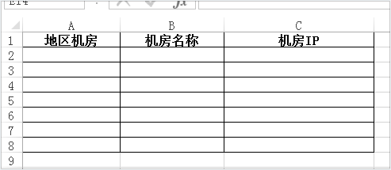

## 先从一级下拉菜单开始 ##
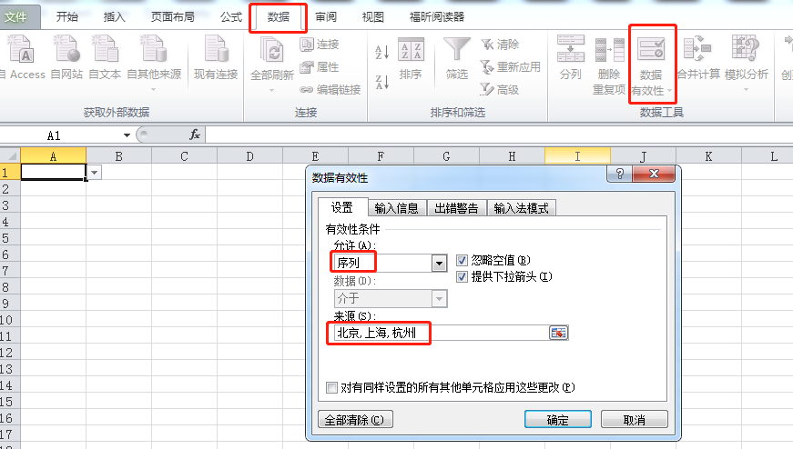

**效果：**
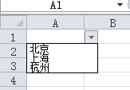

## 开始二级下拉菜单设置 ##
1.需要另一个Sheet来存放一级菜单和二级菜单的关系，如下：
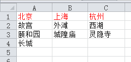

2.选中该Sheet的内容后，创建公式
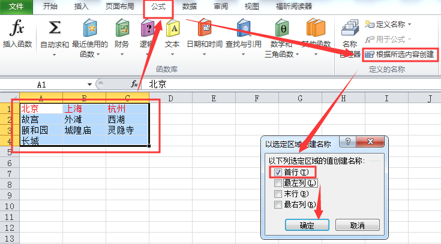

**结果：**
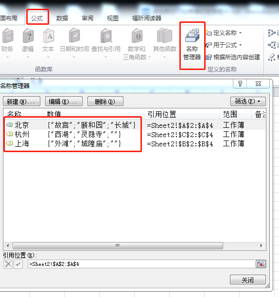

3.回到Sheet1在需要设置第二级下拉菜单的单元格进行如下操作：
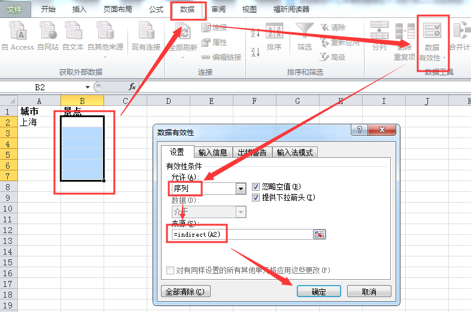

**结果就完成了：**
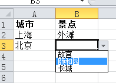

三级等以上就是再建Sheet存二级和三级菜单的关系，然后按照同样的步骤进行即可。

## 补充小技巧 ##
在创建一级下拉菜单时，例子中是手动写的"北京,上海,杭州"(英文逗号)，这里可以直接引用Sheet的信息。
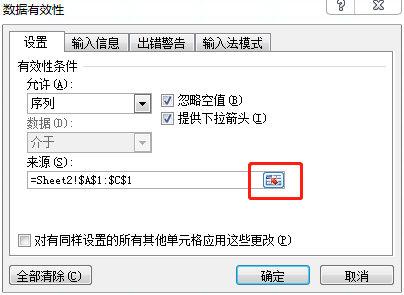
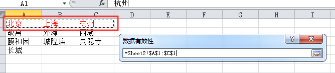

# 下拉菜单并链接图片 #
效果图：

来自网站http://www.wordlm.com/Excel/qmxe/6666.html的gif教程

1. 新建Sheet1，存放名字与照片的对应关系
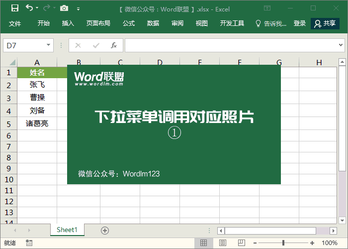
2. 在主Sheet2建立名字的下拉菜单

3. 建立照片公式，=INDIRECT("Sheet1!$B$"&MATCH(Sheet2!$A$2,Sheet1!$A:$A,0))

4. 利用照相机将Sheet1中的图片拷到Sheet2

5. 把拷过来的图片的公式改为 “=照片”

6. 裁剪照片外围的黑线

**说明：**
1.第三步的公式需要按照自己的Sheet表的名字和数据的位置来填，不能盲目拷贝。
- **Sheet1!$B$**   是名字与照片对应Sheet的所有照片所在列
- **Sheet2!$A$2**  是主Sheet中名字下拉菜单所在单元格(就是按照该单元格内容找到对应照片)
- **Sheet1!$A:$A** 是名字与照片对应Sheet的所有名字所在列

2.使用该步骤只能创建一组名字对应照片，如果想在下面再增加一组，实现选择名字，照片跟着名字一起对应着变，这里实现不了。如下效果是想要的：
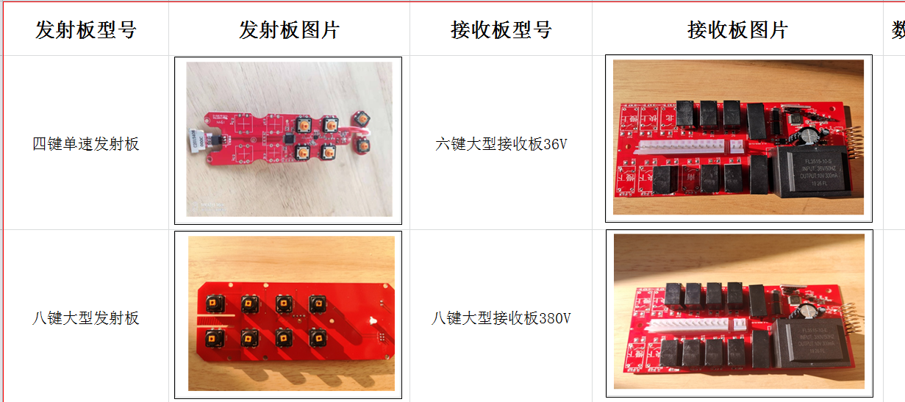
因为上面的第三步的公式中：MATCH(Sheet2!**$A$2**,Sheet1!$A:$A,0)，$A$2是写死的，凡是使用了这条公式的照片都是根据单元格A2上的名字来找到对应的照片的，我们想要让2组独立是做不到了。
目前还没找到好的办法来实现，只能用笨办法，多建几条步骤三的公式，命名为照片1、2、3等，然后第一组的照片公式内写入=照片1  ，第二组写=照片2，以此类推，实现每组独立，可以独立选择不同名字，出现对应不同的照片。 